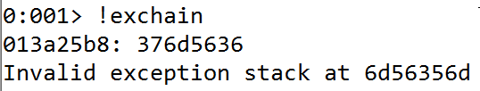
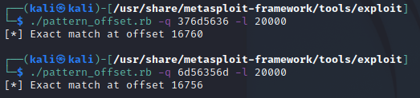
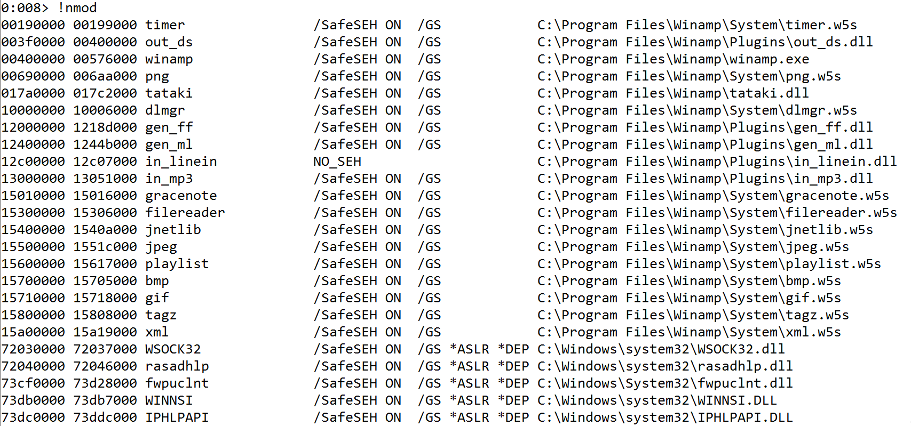
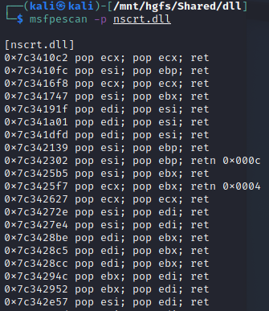
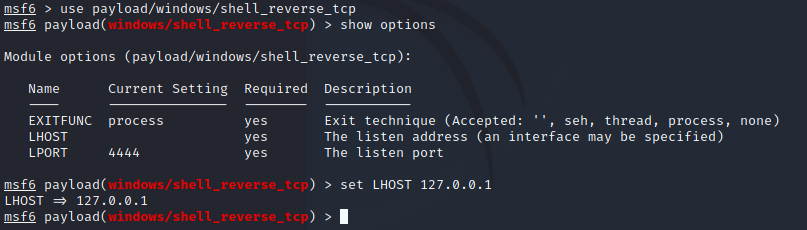
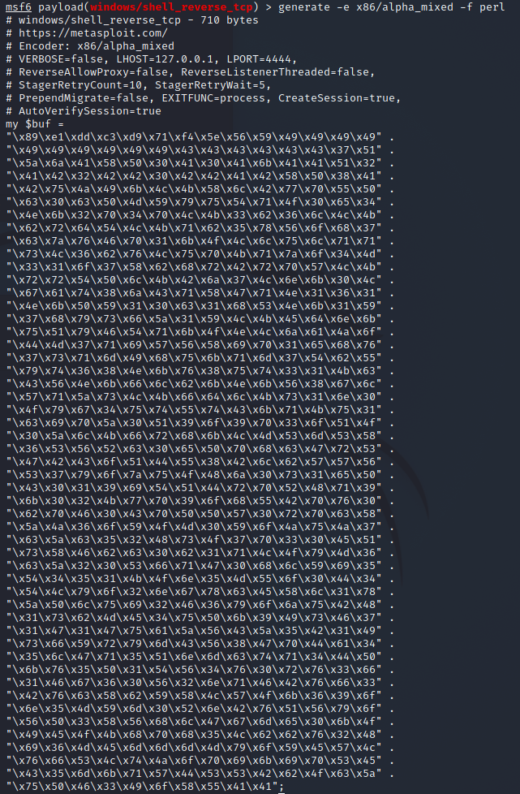
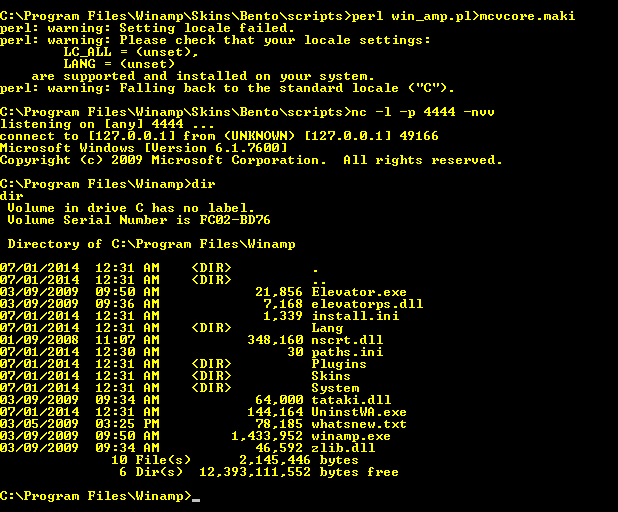

# Programming Assignment 4 - Eric Seals

Documentation for correctly using the exploit generator. There is one directory, named exploitWin, which contains the perl script.

# Exploiting the Winamp Bento skin

## Create the .maki file

There is only one file here, `win_amp.pl` which generates the contents for the `mcvcore.maki` file. 

On the Windows VM, place the perl script at the path `C:\Program Files\Winamp\Skins\Bento\scripts`. Open the Admin Shell to the same location and run the following to create the .maki file:

```bash
> perl win_amp.pl>mcvcore.maki
```

## Find the Offset 

For this exploit to work correctly, it is necessary to exactly overwrite the SEH record words. 
This is done by first finding a value that is sufficiently large to overflow the stack / cause an exception to be raised - 20000 bytes is experimentally found to be large enough. 
With this, the metasploit tools are used to generate a pattern to find exactly the offset from the buffer to the SEH record. 

To generate the pattern, the following was ran on the Kali machine:
```bash
$ cd /usr/share/metasploit-framework/tools/exploit
$ ./pattern_create -l 20000
```

This pattern is used as the value for the string $function_name in the original perl script. 

With Winamp monitored with WinDBG, when the skin is changed to Bento, an exception will be thrown. The following command will show the values in the SEH record:



These values are used to find the offset, particularly the second value (6d56356d above, which is the contents of the first word of the SEH record). This is seen below, and the size 16756 is determined to be the exact offset from the start of the buffer to the start of the SEH record.



## Filling the two SEH record values

The first four bytes of the SEH record will be filled with a `NOP NOP JMP 04`. 
This way when the execution returns (described next), the code jumps to the shell code with is located immediately after the SEH record.

The second four bytes of the SEH record is treated as a pointer to the exception handler implementation. 
Using both Gnarly in WinDBG and msfpescan on Kali, a location containing a code segment of POP POP RET instructions is found in one of the dynamically linked libraries. 
Two pops is needed as it is found that the initial steps Windows takes, before the first SEH record is called, pushes two values on the stack, and they need to be cleared in order to continue execution at the location of the `NOP NOP JMP 04`.  

This figure shows the output of the `!nmod` command from Gnarly. The best .dll's to use for this exploit should avoid the *ASLR protections. 



For example, the `nscrt.dll` library is examined and found to contain many possible memory locations containing the desired sequence. 
There are a few specifications to follow when choosing a location: (1) the address itself should avoid too many consecutive zeros, (2) the pops should be for the edi, esi, and ecx registers, and (3) the return should be empty. 

This figure shows the result of using msfpescan to find a code location. The address `0x7c34272e` is used in the script.  



## Generating the Shell code

Creating the shell byte code is similar to previous assignments. 
Use msfconsole to create a reverse_shell which targets a specific OS, at a specific listening port/address, and use an encoder if desired.
The shell code used is the `windows/shell_reverse_tcp` and is specified for the address `127.0.0.1` at port `4444`. This shell also uses the alpha_numeric encoding. 
The following two figures demonstrate this process:





## Do the exploit

After creating the `mcvcore.maki` file in the correct location as described above, the last step needed is to set a shell with netcat to receive the shell.

In the shell, run the command:

```bash
> nc -l -p 4444 -nvv
```

With this, open Winamp and change the skin to Bento. A shell should open in shell as shown below.



## Modifications

This perl script shouldn't need any modifications, however, if my assumption that all of these values are consistent across the VMs is incorrect then the parameters can be easily modified following the outlined steps above. In the perl script, there are well-labled variables that would simply need the values modified (namely, size of the offset and the location of the `POP POP RET`).
