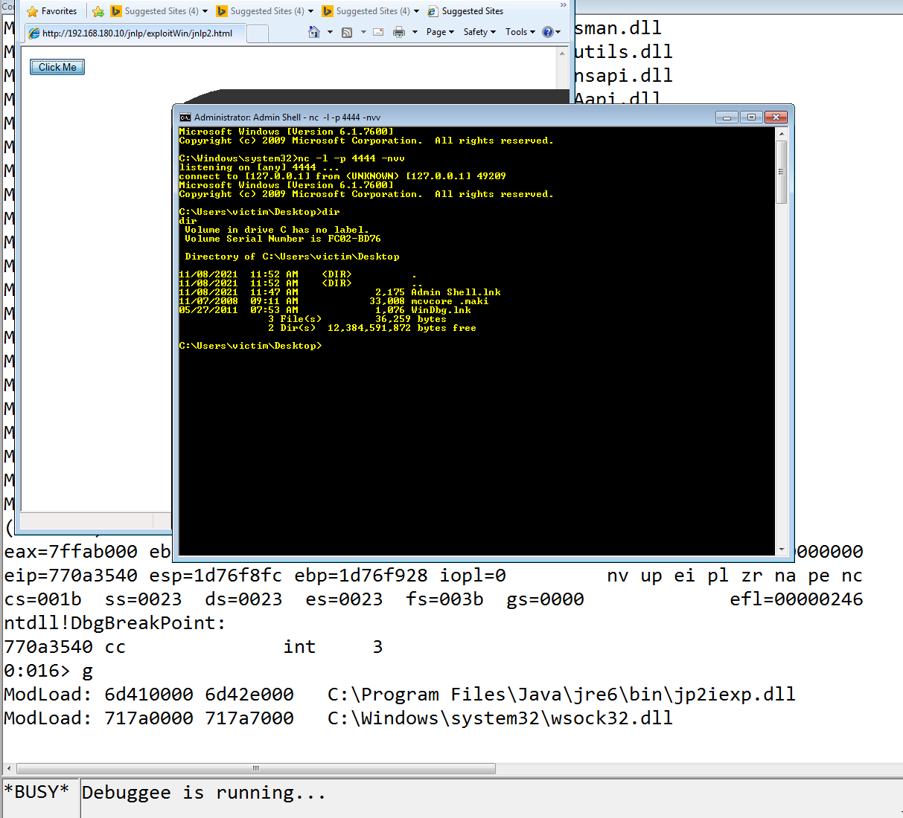

# Programming Assignment 5 - Eric Seals

Documentation for correctly using the exploit generator. There is one directory, named exploitWin, which contains relevant files.

# Exploiting the Java Network Launch protocol in IE8

## Running the exploit

To use this exploit, place the `heaplib.js` and `jnlp.html` files in the Apache web server location (for example, on Kali this is at `/var/www/html/jnlp`). Make sure Apache is running as shown in the following figure:


On the windows machine, open a Admin Shell to receive the reverse_shell and use the following netcat command:

```
> nc -l -p 4444 -nvv
```

Next, open IE8 and navigate to the webserver location (`192.168.180.10/jnlp/jnlp.html`) and click the button.
This exploit is perhaps not the most interesting when shown through a screenshot, but a demonstration of a working exploit flow is shown on the next page.



<div style="page-break-after: always;"></div>

# Thought Process

High level, this exploit works by spraying the heap with a ROP Chain + Shell code + NOP sleds, flipping the stack to be able to execute the ROP chain which itself is used to overcome DEP by calling VirtualProtect to make the heap executable.

In order to do this the exploit needs (1) to know the offset for the buffer overflow, (2) to find gadgets for flipping and calling VirtualProtect, (3) to discover the address of VirtualProtect, (4) and to generate a reverse shell. 

## Finding Offset

This is similar to previous assignments. Using the metasploit framework, a pattern is generated and then relevant substrings of the pattern are used to find desired offsets. An offset of 800 bytes is found to overflow the buffer, so after creating a pattern of that size and creating a crash on IE8, the registers are shown in WinDBG.

.png)

While not obvious here, a prior example with all As made clear the registers `eip`, `ecx`, and `ebp` are possible to control. The next image demonstrates using metasploit to find different offsets to the registers. In particular to this exploit are the offsets 392 to `eip` and 388 to `ebp`.

.png)

<div style="page-break-after: always;"></div>

## Finding Gadgets

In order to flip the stack or to call VirtualProtect to execute the shell, ROP gadgets need to be found in a consistent location. Candidate libraries are found using narly in WinDBG, and the .dll `MSVCR71` is arbitrarily selected. Everything needed for this exploit can be found in this library.

### Flipping Stack

Flipping the stack is possible given that this buffer overflow allows for the `eip` and `ebp` registers to be controlled. To do this, the `eip` is overwritten with the address of a `leave; ret` gadget and the `ebp` register overwritten with the heap address to "flip". 

This is the case as `leave; ret` is ultimately the same as `mov esp, ebp; pop ebp; ret`. So `ebp` is put into `esp`, the top of stack is popped, and then control returns to the new location of `esp`. 

Skyrack is used to find this gadget as shown in the following image. In order to use `sky_search`, a database needs to be built from the .dll.

```
$ sky_build_db msvcr71.dll
$ sky_search -f msvcr71.dll_PE_ia32.sqlite3 -a 'leave' -a 'ret'
```


### Calling Virtual Protect

Finding ROP Gadgets for calling VirtualProtect is the same as discussed above (the next section discusses how to get the actual address), except for different functions. The chain used is the one recommended by Professor Bardas in class, that is:

| `pop eax; ret` |
| Virtual Protect Address |
| `mov eax, [eax]; ret` |
| `call eax; ret` |
| fn params |

The slightly similar chain is not used as `call [eax]` is not found in MSVCR71.dll. The following image shows all the found gadget locations with Skyrack.


## Finding Virtual Protect

To use the above ROP chain to make the shell code executable, the address of the VirtualProtect function is required. Unfortunately, kernerl32.dll (which contains the function) is protected with ASLR and DEP. To overcome these protections, MSVCR71.dll is again examined to see if it contains a function stub to VirtualProtect. This will provide a consistent function pointer (that is, value of the pointer changes but the actual location of the pointer does not) which holds the address used in the ROP chain.

This is found with WinDBG, using narly and the commands `!dh` and `dps`. Narly is first used to get a list of all shared libraries, MSVCR71.dll is picked since it has no ASLR or DEP protections. The header of the library is examined as follows:

```
!dh mxvcr71
```

and the offset for the Import Address Table Directory is examined (as seen in the next image).


The next command dumps all the stubs (function pointers) to various shared libraries, and the VirtualProtectStub is found as seen in the next image (@7c37a140):

```
dps msvcr71+3A000
```


<div style="page-break-after: always;"></div>

## Shell Code

Shell code is generated with msfconsole as discussed in previous assignments. Difference here is that javascript (little-endian) is targeted and no encoder is necessary. This script sends the shell to 127.0.0.1 on port 4444.


## Misc

The parameters for the VirtualProtect function were given as follows (from the slides):


Because of the first parameter, the heap address that is used to overwrite `ebp` is 0x0a0a2020. This way, the ROP chain executes and returns safely within the executable range of memory (shell code is a few hundred bytes and the range of newly executable heap memory is 0x4000).

